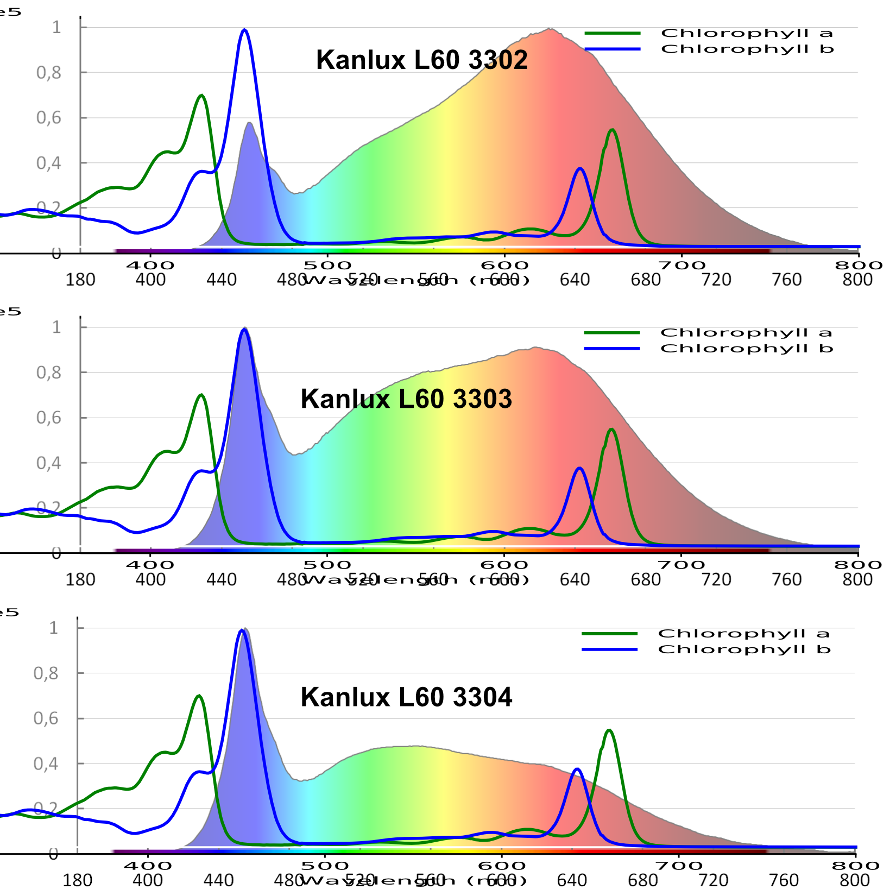
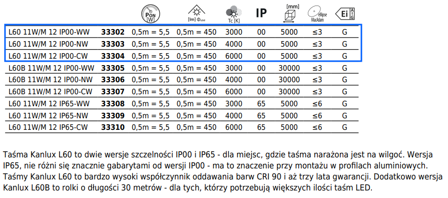

# Ingarden
Interior garden on metal wall-mounted rack

In tribute to https://en.wikipedia.org/wiki/Roman_Ingarden

## Controlbox

### Hardware

Block diagram:

> Block diagram generated with PlantUML in `circuit/circuit.plantuml` file

Din layout:

> Placement and width of the components on the DIN bus

DIN parts to order:

1. DIN surface mount switchgear box for ~20 modules (x18mm)
2. DIN Powersupply 12V 40W
3. 3x DIN PCB box / bus / mount

### Firmware

- Instructions on uploading code to STM32F104 Blue Pill are in [controlboard/README.md](controlboard/README.md)

## Light

1. Grow LED strips
2. White LED that has spectrum that matches Chlorophile: Kanlux L60. Np tu: https://allegro.pl/oferta/kanlux-tasma-led-l60-11w-m-12v-biala-neutralna-5m-12024477473?bi_s=ads&bi_m=listing:desktop:query&bi_c=MzdjNWY5YjQtNTI3Ni00NjZjLWEzMzUtYmRlMDQzOGRkNzVkAA&bi_t=ape&referrer=proxy&emission_unit_id=67477aee-d1df-499b-bda5-1b5068010afe

### Chlorophyll vs Kanlux L60 CRI 90 led strips

