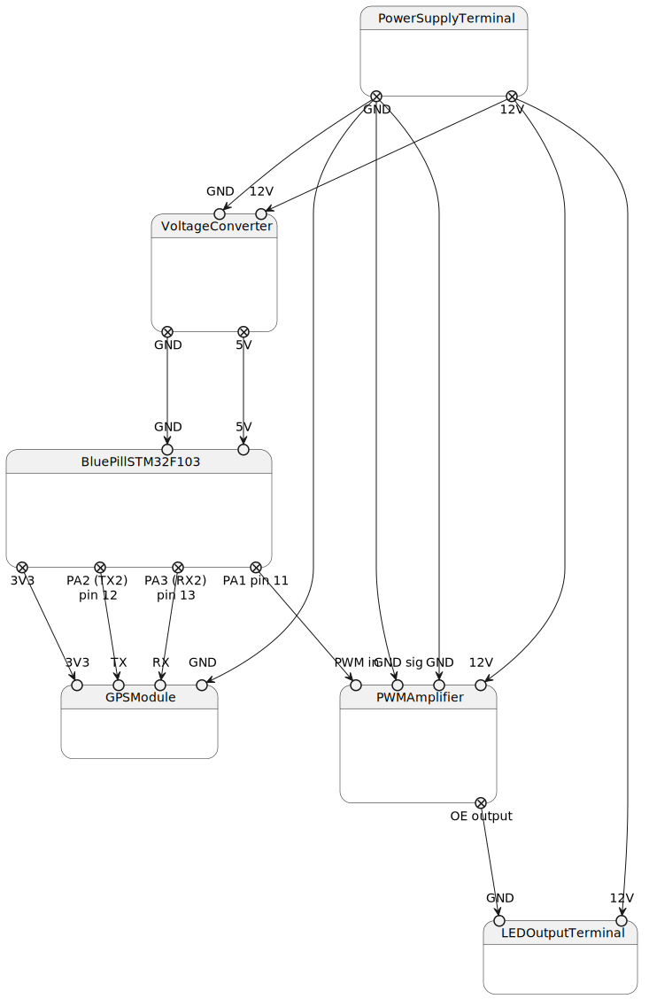

# ingarden
Interior garden on metal wall-mounted rack

In tribute to https://en.wikipedia.org/wiki/Roman_Ingarden

## Controlbox

### Hardware

Block diagram:

> Block diagram generated with PlantUML in `circuit/circuit.plantuml` file

Din layout:

> Placement and width of the components on the DIN bus

DIN parts to order:

1. DIN surface mount switchgear box for ~20 modules (x18mm)
2. DIN Powersupply 12V 40W
3. 3x DIN PCB box / bus / mount

### Firmware

- Instructions on uploading code to STM32F104 Blue Pill are in [controlboard/README.md](controlboard/README.md)

## Light

1. Grow LED strips
2. White LED that has spectrum that matches Chlorophile: Kanlux L60. Np tu: https://allegro.pl/oferta/kanlux-tasma-led-l60-11w-m-12v-biala-neutralna-5m-12024477473?bi_s=ads&bi_m=listing:desktop:query&bi_c=MzdjNWY5YjQtNTI3Ni00NjZjLWEzMzUtYmRlMDQzOGRkNzVkAA&bi_t=ape&referrer=proxy&emission_unit_id=67477aee-d1df-499b-bda5-1b5068010afe

# Notes

## Taśma led biała

Jeśli biała to dopasować spektrum taśmy do chlorofilu. Taśma kanlux L60 ma dopasowane spektrum

1. 1. 

## Oświetlenie, wersja z taśmą [PL]

Elementy na pewno:

1. - [x] Profil aluminiowy 1m (do przecięcia) * 6 półek = 6*1m (w koszyku)
2. - [x] Taśma dwustronna do profilu
3. - [x] Złączki do taśm
4. - [x] Taśma LED 14,4W * 0,5m * 4 = 2m = 28,8W
5. - [x] Zasilacz LED IP65
6. - [x] Moduł PWM
7. - [x] Przetwornica step-down 12 -> 5v
8. Zabrać z Warszawy Arduino / moduły 5V (koniecznie 5V!)

W przyszłości:

1. Moduł DCF lub GPS (źródło czasu)
2. Czujnik otwarcia drzwi
3. Czujnik natężenia światła rozproszony
4. Skrzynka metalowa
5. Kabel z włącznikiem

Bezpieczeństwo:

1. Aluminiowe koryto bez osłonki
2. Zasilacz z zabezpieczeniem + małe natężenie nominalne
3. Cała elektronika w metalowej skrzynce
4. Zamontowane na aluminiowej półce (nie ma palnych elementów)

